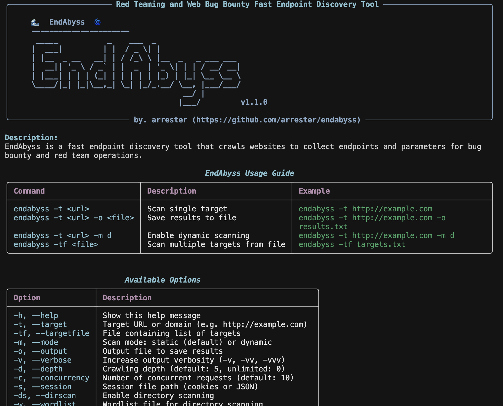

# 🌊 EndAbyss

Python Version
License
Version

EndAbyss is a fast endpoint discovery tool that crawls websites to collect endpoints and parameters for bug bounty and red team operations.



## 🌟 Features

- **Red Team/Bug Boun1.0ty Support**: Useful for both red team operations and web bug bounty projects
- **Static/Dynamic Scanning**: Fast static scanning or Playwright-based dynamic scanning for modern frameworks
- **Endpoint Discovery**: Automatic collection of endpoints from HTML, JavaScript, and API responses
- **Parameter Extraction**: Automatic extraction of GET/POST parameters from forms and URLs
- **Directory Scanning**: Wordlist-based directory brute-forcing support
- **Pipeline Integration**: Supports integration with other tools using `-pipeurl`, `-pipeendpoint`, `-pipeparam`, `-pipejson` options
- **WAF Bypass Options**: Delay, random delay, rate limiting, and proxy support
- **Modular Design**: Can be imported and used as a Python module

  


## 🚀 Installation

**bash**

```bash
git clone https://github.com/arrester/endabyss.git
cd endabyss
pip install -r requirements.txt
pip install -e .
```

or   


**Python**

```bash
pip install endabyss
```

For dynamic scanning mode, install Playwright browsers:

```bash
playwright install chromium
```

  


## 📖 Usage

### CLI Mode

**Basic Scan**  

`endabyss -t http://example.com`

**Dynamic Scanning Mode**  

`endabyss -t http://example.com -m dynamic`

**Directory Scanning**  

`endabyss -t http://example.com -ds -w wordlist.txt`

**Pipeline Output**  

`endabyss -t http://example.com -pipeurl` # Output URLs only  

`endabyss -t http://example.com -pipeendpoint` # Output endpoints only  

`endabyss -t http://example.com -pipeparam` # Output parameters only  

`endabyss -t http://example.com -pipejson` # Output JSON format

**Pipeline Integration Example**  

`endabyss -t http://example.com -pipeurl | sqlmap --batch`

### Integration with SubSurfer
Pipeline configuration for scanning endpoints with EndAbyss from web subdomains collected by SubSurfer:

**1. Basic Integration (Web Subdomains → Endpoint Collection)**  

`subsurfer -t example.com -pipeweb | xargs -I {} endabyss -t {} -pipeurl`

**2. Save Results to File**  

`subsurfer -t example.com -pipeweb | xargs -I {} endabyss -t {} -o results.txt`

**3. Integration with Dynamic Scan Mode**  

`subsurfer -t example.com -pipeweb | xargs -I {} endabyss -t {} -m dynamic -pipeurl`

**4. Collect Detailed Information in JSON Format**  

`subsurfer -t example.com -pipeweb | xargs -I {} endabyss -t {} -pipejson`

**5. Include Directory Scanning**  

`subsurfer -t example.com -pipeweb | xargs -I {} endabyss -t {} -ds -w wordlist.txt -pipeurl`

### Using as a Python Module

**Basic Endpoint Scan**  


```python
from endabyss.core.controller.controller import EndAbyssController
import asyncio

async def main():
    controller = EndAbyssController(
        target="http://example.com",
        mode="static",
        verbose=1,
        depth=5
    )
    
    results = await controller.scan()
    
    print(f"Found {len(results['endpoints'])} endpoints")
    print(f"Found {len(results['forms'])} forms")
    print(f"Found {len(results['parameters'])} parameter sets")
    
    for param_data in results['parameters']:
        url = param_data['url']
        params = param_data.get('parameters', {})
        param_str = '&'.join([f"{k}={v}" for k, v in params.items()])
        print(f"{url}?{param_str} [{param_data['method']}]")

if __name__ == "__main__":
    asyncio.run(main())
```

  


**Dynamic Scanning**  


```python
from endabyss.core.controller.controller import EndAbyssController
import asyncio

async def main():
    controller = EndAbyssController(
        target="http://example.com",
        mode="dynamic",
        headless=True,
        wait_time=3.0
    )
    
    results = await controller.scan()
    
    for endpoint in results['endpoints']:
        print(endpoint['url'])

if __name__ == "__main__":
    asyncio.run(main())
```

  


**Result Save**  


```python
from endabyss.core.controller.controller import EndAbyssController
import asyncio

async def main():
    controller = EndAbyssController("http://example.com")
    
    results = await controller.scan()
    
    output_path = controller.get_output_path("results.json")
    controller.save_results(results, output_path)
    print(f"Results saved to: {output_path}")

if __name__ == "__main__":
    asyncio.run(main())
```

  


## 🔧 Key Features from Reference Tools

EndAbyss incorporates key features from various reference tools:

- **Katana**: Deep crawling and endpoint discovery methodology
- **LinkFinder**: JavaScript endpoint extraction using regex patterns
- **ParamSpider**: Parameter extraction and URL cleaning techniques
- **SubSurfer**: CLI design, pipeline integration, and modular architecture

  


## 📋 Available Options


| Option              | Description                                 |
| ------------------- | ------------------------------------------- |
| `-t, --target`      | Target URL or domain                        |
| `-tf, --targetfile` | File containing list of targets             |
| `-m, --mode`        | Scan mode: static (default) or dynamic      |
| `-d, --depth`       | Crawling depth (default: 5)                 |
| `-c, --concurrency` | Number of concurrent requests (default: 10) |
| `-ds, --dirscan`    | Enable directory scanning                   |
| `-w, --wordlist`    | Wordlist file for directory scanning        |
| `--delay`           | Delay between requests in seconds           |
| `--random-delay`    | Random delay range (e.g. 1-3)               |
| `--proxy`           | Proxy URL (HTTP/HTTPS/SOCKS5)               |
| `--rate-limit`      | Rate limit (requests per second)            |
| `-pipeurl`          | Output URLs only for pipeline               |
| `-pipeendpoint`     | Output endpoints only for pipeline          |
| `-pipeparam`        | Output parameters only for pipeline         |
| `-pipejson`         | Output JSON format for pipeline             |


  


## 📋 Requirements

- Recommended: Python 3.13.0 or later
- aiohttp
- beautifulsoup4
- playwright (for dynamic scanning)
- rich
- requests

## 📝 License

MIT License

## 🤝 Contributions

Bug Report, Feature Suggestions, Issue Report